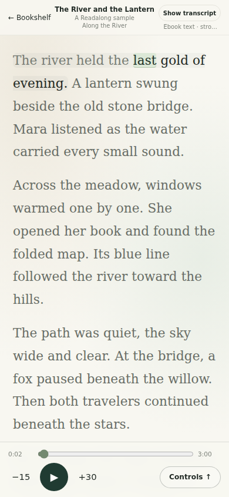
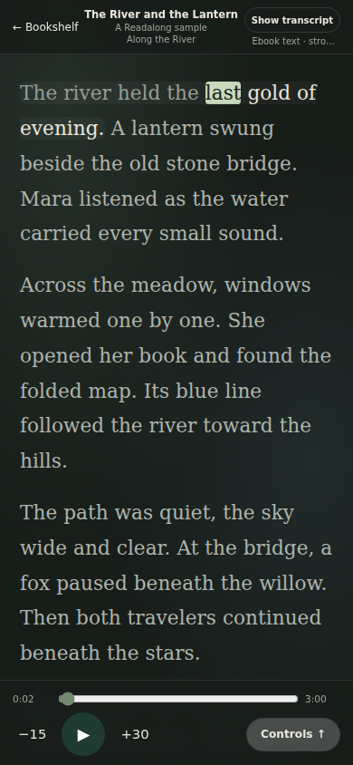

<p align="center">
  <a href="https://exe.dev/">
    
  </a>
</p>

# Readalong

**A private, mobile-first audiobook reader that keeps the words in time with the
audio.** Add an audiobook file, a direct audio URL, or a YouTube link; Readalong
transcribes it with Groq and presents a calm reader with synchronized word
highlighting.

Readalong is built to run on a private [exe.dev](https://exe.dev/) VM. Each
authenticated exe.dev identity receives a separate bookshelf. The source
repository is public; the running service and its users' media should remain
private.

## What it does

- Upload MP3, M4A/M4B, WAV, FLAC, OGG/OPUS, WEBM, or MP4 audio.
- Import YouTube audio without cookies, or fetch a direct public HTTP(S) media URL.
- Transcribe in resumable chunks with Groq word timestamps; keep completed work
  when rate-limited.
- Upload an audiobook and EPUB together; reflow the EPUB spine and align its
  canonical words to transcript timestamps with a confidence-scored fallback.
- Search your bookshelf by title or author.
- Search free LibriVox audio on Internet Archive and match it to Project
  Gutenberg text. Prefer source-linked IDs; when IA omits one, show exact
  title/author candidates for the user to verify before import.
- Read with absolute-time word highlighting, tap-to-seek, playback speed, saved
  position, and per-book appearance/sync settings.
- Use a private exe.dev-authenticated bookshelf with automatic account
  provisioning and server-side ownership checks.
- Install as a PWA; the web app and its media service remain on one VM.

## Screenshots

These mobile previews use generated sample text and a demo identity; no private
bookshelf or uploaded audiobook is shown.

<p align="center">
  
  
  
</p>

**Alignment caveat:** Readalong can now extract EPUB text and align it against
the audiobook transcript. A source link or exact title/author candidate is not
proof of an identical edition. When text match confidence is low, the reader
defaults to the transcript and never animates untimed ebook words.
This first EPUB implementation still needs validation across varied real
editions. R2/Litestream backup/restore is not implemented yet. Generic yt-dlp
webpage extraction is also not enabled; use YouTube URLs, direct media URLs,
or the paired-book discovery results for now. Search uses public catalog
metadata; media is downloaded only after the user confirms the selected pair.
Source links and title/author candidates are not worldwide rights guarantees;
verify the particular recording, text, and translation for your use.

## Stack

- Go `net/http`, SQLite, embedded HTML/CSS/ES modules.
- `yt-dlp` + Deno, `ffmpeg`, `ffprobe`.
- Groq speech-to-text.
- Local persistent media files; optional Cloudflare R2 + Litestream/rclone later.
- No frontend build step, Docker, Redis, or separate queue service.

## Requirements

- A private exe.dev VM (or a localhost development environment).
- Go 1.23 or newer, Python 3 with `venv`, `ffmpeg`, and `ffprobe`.
- A Groq API key for transcription; you can start with Groq's free tier.
- `scripts/bootstrap-exe.sh` installs yt-dlp with its EJS support and Deno.

## Groq API key (free to start)

You can create a Groq account and API key on the free tier before adding a
payment method. The [Groq Console sign-in page](https://console.groq.com/login)
offers Google, GitHub, SSO, and email sign-in. Then create a key on the
[API Keys page](https://console.groq.com/keys) and put it in the private,
git-ignored `.env` as `GROQ_API_KEY=...`. Never commit or share the key.

The free tier has model-specific rate limits; a long audiobook may pause at a
limit. Readalong saves completed transcription chunks and automatically
resumes queued work. Check Groq's [current rate limits](https://console.groq.com/docs/rate-limits)
for the model and account. If you later need higher limits, upgrading to the
Developer tier is optional and requires a payment method; see Groq's
[Billing FAQs](https://console.groq.com/docs/billing-faqs).

## Data and privacy

Audio, transcripts, SQLite state, and progress are stored under `APP_DATA_DIR`
on the VM. Audio chunks are sent to Groq for transcription. By default, media
and database files remain local; optional R2 backup requires separate,
bucket-scoped credentials. API ownership is keyed by the exe.dev stable user
ID, not by email. Pair searches send the title query to Internet Archive (and
use LibriVox as a bounded fallback); the server also refreshes a public
Project Gutenberg metadata catalog weekly. Audio and the selected EPUB are
downloaded into the private library only after the user confirms an import.

See [`docs/ARCHITECTURE.md`](docs/ARCHITECTURE.md),
[`docs/API_AND_SCHEMA.md`](docs/API_AND_SCHEMA.md), and
[`docs/IMPLEMENTATION_STATUS.md`](docs/IMPLEMENTATION_STATUS.md).

## Deploy to exe.dev

<p>
  <a href="https://exe.dev/new?repo=https://github.com/jgbrwn/readalong">
    
  </a>
</p>

The button starts an exe.dev VM workflow for this public repository, opens
Shelley, and supplies the repository's agent instructions. It does **not**
contain or inject API credentials. On the VM:

1. Open/clone this repository in `~/readalong`. Keep the exe.dev share private
   and route it to port `8000`.
2. Create `.env` with mode `600` and set `GROQ_API_KEY`,
   `APP_BASE_URL=https://YOUR-VM.exe.xyz`, and either `ADMIN_USER_IDS` or
   `ADMIN_BOOTSTRAP_EMAILS`:

   ```sh
   cp .env.example .env
   chmod 600 .env
   $EDITOR .env
   ```

3. Bootstrap dependencies, check configuration, run tests, and install the
   systemd service:

   ```sh
   ./scripts/bootstrap-exe.sh
   ./scripts/doctor.sh
   go test ./...
   make install-service
   ```

Invite/manage visitors through exe.dev. Every identity that its proxy
authenticates receives an account automatically; Readalong does not maintain
an email allowlist.

The app always binds to `127.0.0.1`; `APP_PORT` changes only the port, never the
bind host. `make install-service` renders the systemd unit for the current user
and checkout path.

### Optional R2 administration and backups

`CLOUDFLARE_API_TOKEN` in `.env` is optional and only for manual Wrangler
administration. The app removes it from its runtime environment. R2 S3 access
requires separate bucket-scoped values: `R2_ACCOUNT_ID`,
`R2_ACCESS_KEY_ID`, and `R2_SECRET_ACCESS_KEY`. R2/Litestream is not needed to
run Readalong and remains disabled until deliberately configured. After
installing Litestream and setting up the private bucket, enable the optional
wrapper with `make install-litestream-service`; this replaces the regular
systemd service so only one app process serves the port.

## Local development

For development on localhost without proxy headers:

```sh
APP_ENV=development AUTH_REQUIRE_EXE=false APP_PORT=8000 go run ./cmd/readalong
```

Development identity defaults to `DEV_USER_ID` / `DEV_USER_EMAIL`; never enable
development mode on an Internet-facing deployment. The listener is still
loopback-only.

## Identity and admin

`X-ExeDev-UserID` is the durable user key; email is mutable display metadata.
On first authenticated API use, a user record is created. Admin access can be
configured by stable `ADMIN_USER_IDS`. For first setup,
`ADMIN_BOOTSTRAP_EMAILS` grants admin to the first matching authenticated
identity and binds that claim to its stable user ID. Admins keep their own
bookshelf; admin controls can list accounts and suspend/reactivate access but
do not bypass book ownership.

## License

MIT. See [`LICENSE`](LICENSE).
